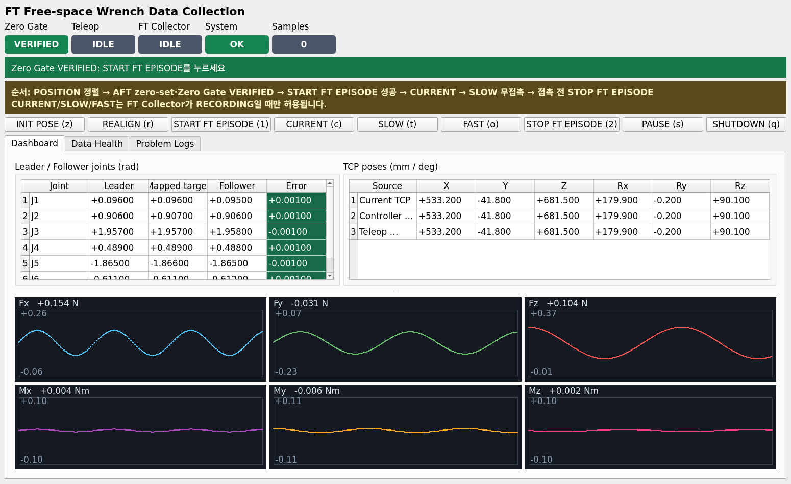

# Free-space wrench 모델 데이터 수집

작성 기준: `2026-08-08 16:19:11 KST (+0900)`

## 목적

오른팔 follower가 아무 물체와도 접촉하지 않고 움직일 때 AFT가 측정하는
`[Fx,Fy,Fz,Mx,My,Mz]`를 robot state `[q,dq,causal-qdd]`와 함께 `262.5 Hz`로
저장한다. 학습 후 모델은 움직임에 의한 wrench를 예측하며 최종 contact wrench는
다음과 같다.

```text
contact_wrench = bias-removed physical FT raw - predicted free-space wrench
```

## FT 전용 GUI 화면



위 이미지는 실제 `ft_fb_leaderarm` GUI를 offscreen으로 렌더링한 화면이다. 화면
구조를 설명하기 위해 `Zero Gate=VERIFIED`, `Teleop=IDLE`과 wrench 곡선에는 모의
표시값을 넣었으며 실제 수집 결과가 아니다. 스크린샷을 만들 때 ROS service와 robot
명령은 호출하지 않았다.

| 화면 항목 | 의미 |
|---|---|
| Zero Gate | 새 episode를 시작할 수 있는지 표시한다. `VERIFIED`이면 시작 가능하다. |
| Teleop | `IDLE`, `CURRENT`, `SLOW`, `FAST`, `PAUSE` 등 leader 상태다. |
| FT Collector | `IDLE` 또는 `RECORDING`을 표시한다. |
| System | teleop/collector 통신과 gate를 종합한 상태다. |
| Samples | 현재 episode에 저장된 row 수다. |
| START FT EPISODE | `/ft_free_space_collector/start_episode`를 호출한다. |
| STOP FT EPISODE | episode를 파일로 저장하고 수집을 종료한다. |
| Data Health | `force_median_n`, `force_std_n`, gate reason 등 원본 diagnostics다. |
| Problem Logs | START 거부와 service 오류의 원문을 보여준다. |

`START FT EPISODE` 성공 전에는 GUI가 CURRENT/SLOW/FAST를 차단한다. 수집이 시작된
뒤에는 Zero Gate가 `LATCHED`로 표시된다. 이는 robot이 fixed zero pose를 벗어나
live `zero.ready=false`가 되어도 이미 승인된 episode는 계속 기록된다는 뜻이다.

## 실행 전 원칙

- robot/leader를 움직이는 명령은 운용자가 주변 안전을 확인한 뒤 직접 실행한다.
- 첫 episode는 `20~30초`, SLOW, 완전 무접촉으로 제한한다.
- AFT cable이 당겨지거나 robot/tool에 닿지 않게 고정한다.
- tool, payload, controller 설정은 현재 사용 중인 상태를 변경하지 않는다.
- 접촉하기 전에 leader 움직임을 멈추고 episode를 종료한다.
- 장시간 실행 node는 각각 별도 terminal에서 실행한다.
- 이미 실행 중인 driver/controller/AFT를 같은 명령으로 중복 실행하지 않는다.

## 데이터 수집 순서와 명령

### 1. PC 공통 환경 설정

새 PC terminal마다 실행한다. DDS domain, workspace, 데이터 경로와 기존
payload/controller metadata를 설정한다.

```bash
source /opt/ros/humble/setup.bash
source /home/vision/contact_pipeline_ws/install/setup.bash
source /home/vision/dualarm_ws/install/setup.bash
source /home/vision/venv_act/bin/activate

export RMW_IMPLEMENTATION=rmw_cyclonedds_cpp
export ROS_DOMAIN_ID=7
export ROS_LOCALHOST_ONLY=0
export CYCLONEDDS_URI=file:///home/vision/cyclonedds_dualarmPC.xml
export ROS_LOG_DIR=/tmp/ft_fb_leaderarm_ros_logs

export FT_PACKAGE_ROOT=/home/vision/dualarm_ws/src/ft_fb_leaderarm
export FT_DATA_DIR=/home/vision/.ros/ft_fb_leaderarm/data
export FT_PAYLOAD_ID=right_tool_m2p1kg_oz0p17m_v1
export FT_CONTROLLER_HASH=bae_r_v2_c113eabf7e13_ca07ae197213
```

### 2. PC-SBC 시계와 입력 topic 확인

다음 명령은 robot을 움직이지 않는다. Chrony 결과의 마지막 판정이 `GO`이고 두
topic에 publisher가 있어야 한다.

```bash
cd /home/vision/dualarm_ws/src/ft_fb_leaderarm
sudo -v
/home/vision/dualarm_ws/src/fb_leaderarm/scripts/dualarm_chrony_mode.sh status

ros2 topic info /contact_state/observer_input --verbose
ros2 topic info /aft_sensor2/wrench --verbose
timeout 15s ros2 topic hz /contact_state/observer_input
timeout 15s ros2 topic hz /aft_sensor2/wrench
```

### 3. SBC driver/controller/AFT 실행 상태 확인

현재 세 process가 이미 실행 중이면 아래 확인 명령만 실행하고 launch를 중복 실행하지
않는다.

```bash
ros2 control list_controllers -c /dsr01/controller_manager
ros2 topic info /contact_state/observer_input --verbose
ros2 topic info /aft_sensor2/wrench --verbose
```

재시작이 필요할 때만 각각 별도 SBC terminal에서 다음을 실행한다.

SBC terminal 1, robot driver:

```bash
source /opt/ros/humble/setup.bash
source /home/vision/doosan_ws/install/setup.bash
export RMW_IMPLEMENTATION=rmw_cyclonedds_cpp
export ROS_DOMAIN_ID=7
export ROS_LOCALHOST_ONLY=0
export ROBOT_NORMAL_IP=192.168.112.4
export ROBOT_RT_IP=192.168.137.50

ros2 launch dsr_bringup2 dsr_bringup2_rviz.launch.py \
  name:=dsr01 mode:=real model:=m0609 \
  host:="${ROBOT_NORMAL_IP}" port:=12345 rt_host:="${ROBOT_RT_IP}"
```

SBC terminal 2, impedance controller:

```bash
source /opt/ros/humble/setup.bash
source /home/vision/doosan_ws/install/setup.bash
export RMW_IMPLEMENTATION=rmw_cyclonedds_cpp
export ROS_DOMAIN_ID=7
export ROS_LOCALHOST_ONLY=0

ros2 launch dsr_realtime_control \
  impedance_control_vr_dls_f_comp_bae_r_v2.launch.py
```

SBC terminal 3, AFT:

```bash
source /opt/ros/humble/setup.bash
source /home/vision/doosan_ws/install/setup.bash
export RMW_IMPLEMENTATION=rmw_cyclonedds_cpp
export ROS_DOMAIN_ID=7
export ROS_LOCALHOST_ONLY=0

ros2 launch aft_can_hardware aft_sensor.launch.py
```

### 4. AFT sensor2 rate를 500 Hz로 명시

AFT를 새로 시작했을 때 SBC에서 한 번 실행한다. 이 명령은 sensor sample period를
`2 ms`로 설정하는 one-shot 명령이며 ROS wrench publish는 약 `1000 Hz`로 유지된다.

```bash
ros2 topic pub --once /aft_sensor2/sample_rate_setting \
  std_msgs/msg/Int32 "{data: 500}"
```

### 5. PC에서 feedback-OFF teleop 실행

이 명령은 leader hardware와 follower command에 영향을 줄 수 있으므로 운용자가 안전을
확인하고 직접 실행한다. GUI의 순서 guard를 terminal key로 우회하지 않도록 keyboard를
비활성화한다.

process가 시작되면 leader는 position mode에서 현재 follower 자세로 자동 `ALIGN`한
뒤 `IDLE`이 된다. 이 startup `ALIGN`은 leader를 실제로 움직일 수 있지만 follower
command는 발행하지 않는다.

```bash
source /opt/ros/humble/setup.bash
source /home/vision/contact_pipeline_ws/install/setup.bash
source /home/vision/dualarm_ws/install/setup.bash

ros2 run ft_fb_leaderarm ft_fb_leader_single_impedance_teleop --ros-args \
  --params-file "${FT_PACKAGE_ROOT}/config/single_impedance_leader_damping.yaml" \
  -p side:=right \
  -p feedback_source:="'off'" \
  -p keyboard_input_enabled:=false
```

### 6. fixed zero pose와 leader 정렬 확인

목표 자세는 다음과 같다.

```text
[5.5, 52.0, 112.0, 28.0, -107.0, -35.0] degree
```

startup 후 follower가 위 자세이고 status가 `IDLE`이면 자동 `ALIGN`까지 완료된
것이므로 `INIT POSE`와 `REALIGN`을 다시 실행하지 않는다.

follower가 위 자세가 아닐 때만 다음 명령을 운용자가 직접 실행한다. `INIT POSE`는
follower를 실제로 움직이며, 완료 로그를 확인한 뒤 `REALIGN`으로 leader를 다시
follower에 맞춘다.

```bash
ros2 service call /leader_teleop_node/command/init_pose \
  std_srvs/srv/Trigger {}

ros2 topic echo /leader_teleop_node/status --once

ros2 service call /leader_teleop_node/command/realign \
  std_srvs/srv/Trigger {}

ros2 topic echo /leader_teleop_node/status --once
```

최종 status의 `state`가 `IDLE`이어야 한다. CURRENT로 전환하면 안 된다.

### 7. SBC에서 AFT hardware zero-set2 실행

follower가 fixed zero pose에서 완전히 정지하고 tool이 무접촉인지 확인한 뒤 SBC에서
실행한다.

```bash
source /opt/ros/humble/setup.bash
source /home/vision/doosan_ws/install/setup.bash
export RMW_IMPLEMENTATION=rmw_cyclonedds_cpp
export ROS_DOMAIN_ID=7
export ROS_LOCALHOST_ONLY=0

ros2 topic info /aft_sensor2/bias_setting --verbose
ros2 launch aft_can_hardware aft_zero_set2.launch.py \
  sensor_name:=aft_sensor2
```

정상 로그는 다음 두 문장이다.

```text
Hardware bias (tare) requested and acknowledged
Zero set completed. Exiting after callback.
```

### 8. PC에서 FT collector와 전용 GUI 실행

zero-set마다 중복되지 않는 ID를 사용한다. 아래 `tare_YYYYMMDD_01`은 실제 날짜와
순번으로 바꾼다. 이 명령 자체는 robot을 움직이지 않는다.

```bash
ros2 launch ft_fb_leaderarm collect_free_space_gui.launch.py \
  output_dir:="${FT_DATA_DIR}" \
  zero_set_confirmed:=true \
  zero_set_id:=tare_YYYYMMDD_01 \
  payload_id:="${FT_PAYLOAD_ID}" \
  controller_config_hash:="${FT_CONTROLLER_HASH}"
```

GUI에서 다음 상태를 기다린다.

```text
Zero Gate: VERIFIED
Teleop: IDLE
FT Collector: IDLE
System: OK
```

terminal에서 같은 상태를 확인하려면 다음을 실행한다.

```bash
ros2 topic echo /ft_free_space_collector/diagnostics --once
```

`zero.ready=true`, `zero.reason=zero_verified`가 아니면 START하지 않는다.

### 9. 첫 FT episode 시작

GUI에서 `START FT EPISODE (1)`을 누른다. 동일한 terminal 명령은 다음과 같다.

```bash
ros2 service call /ft_free_space_collector/start_episode \
  std_srvs/srv/Trigger {}
```

성공 조건은 service의 `success=true`와 GUI의 `FT Collector=RECORDING`이다. median
norm이 `1.0 N`을 넘으면 `zero_force_offset_too_large`, 축 STD가 `0.40 N`을 넘으면
`zero_force_noise_too_large`로 START만 거부된다. AFT publish와 robot은 중단되지 않는다.

### 10. 운용자가 CURRENT와 SLOW로 전환

GUI에서 `CURRENT (c)`를 누른 뒤 `Teleop=CURRENT`를 확인하고 `SLOW (t)`를 누른다.
이 두 동작은 leader/follower에 영향을 주므로 운용자가 직접 실행한다. 동일한 service
명령은 다음과 같다.

```bash
ros2 service call /leader_teleop_node/command/current \
  std_srvs/srv/Trigger {}

ros2 topic echo /leader_teleop_node/status --once

ros2 service call /leader_teleop_node/command/slow \
  std_srvs/srv/Trigger {}

ros2 topic echo /leader_teleop_node/status --once
```

CURRENT 전환 순간 leader pose가 조금 변해 follower가 움직이는 구간도 정상적인
free-space transient로 같은 episode에 기록된다. 첫 episode에서는 FAST를 사용하지
않는다.

### 11. 20~30초 동안 SLOW 무접촉 동작

운용자가 leader를 천천히 움직인다. 다음 항목을 포함하되 접촉은 없어야 한다.

- 여러 joint의 양방향 움직임
- 완만한 가속과 감속
- 짧은 정지 구간
- cable이 당겨지지 않는 작업 범위

수집 상태를 별도 terminal에서 확인한다.

```bash
ros2 topic echo /ft_free_space_collector/diagnostics --once
```

`collecting=true`, `samples` 증가, `sync_rejections=0`, `invalid_rejections=0`이
기대값이다. 수집 중 `Zero Gate=LATCHED`는 정상이다.

### 12. 접촉 전에 정지하고 episode 저장

먼저 leader 움직임을 멈추고 follower가 정지한 것을 확인한다. GUI의 `PAUSE (s)`를
누른 다음 `STOP FT EPISODE (2)`를 누른다. 동일한 service 명령은 다음과 같다.

```bash
ros2 service call /leader_teleop_node/command/pause \
  std_srvs/srv/Trigger {}

ros2 service call /ft_free_space_collector/stop_episode \
  std_srvs/srv/Trigger {}
```

STOP 응답의 `training_accepted=true`와 저장 경로를 확인한다.

### 13. 저장 파일 확인

가장 최근 metadata를 확인한다.

```bash
ls -lt "${FT_DATA_DIR}" | head

jq '{accepted,zero_set_id,payload_id,controller_config_hash,samples,duration_s,
     actual_hz,max_record_gap_ms,sync_rejections,invalid_rejections}' \
  "$(ls -1t "${FT_DATA_DIR}"/*.json | head -1)"
```

첫 episode의 기대값은 다음과 같다.

```text
accepted=true
duration_s >= 10
actual_hz ≈ 262.5
max_record_gap_ms <= 10
sync_rejections=0
invalid_rejections=0
```

저장된 `.npz`와 `.json` 경로를 다음 검증 작업을 위해 기록한다.

### 14. 독립 zero-set group 반복과 dataset 검증

정식 dataset은 최소 3개의 독립 `zero_set_id`가 필요하다. 새로운 group마다 fixed
pose 복귀, AFT zero-set2, collector/GUI 재실행을 반복한다.

```text
tare_YYYYMMDD_01
tare_YYYYMMDD_02
tare_YYYYMMDD_03
```

3개 이상을 모은 뒤 실행한다.

```bash
ros2 run ft_fb_leaderarm ft_free_space_validate -- \
  --data-dir "${FT_DATA_DIR}" \
  --seed 7 \
  --output "${FT_DATA_DIR}/dataset_validation_v1.json"

jq . "${FT_DATA_DIR}/dataset_validation_v1.json"
```

첫 episode 하나만 있을 때 validator가 최소 3개 group 부족으로 실패하는 것은 정상이다.

## 지금 사용자가 수행할 다음 작업

현재 driver, impedance controller, AFT가 실행 중이라는 전제에서 다음 한 번만 수행한다.

1. PC에서 feedback-OFF teleop를 `keyboard_input_enabled=false`로 실행한다.
2. 운용자가 `INIT POSE → REALIGN`을 수행하고 Teleop `IDLE`을 확인한다.
3. SBC에서 sample rate `500` one-shot과 `aft_zero_set2`를 실행한다.
4. PC에서 `collect_free_space_gui.launch.py`를 고유 `zero_set_id`로 실행한다.
5. GUI가 `VERIFIED/IDLE/IDLE/OK`이면 START한다.
6. 운용자가 `CURRENT → SLOW`로 전환하여 20~30초 무접촉으로 움직인다.
7. 움직임 정지 → PAUSE → 접촉 전 STOP 순서로 저장한다.
8. 생성된 `.npz`와 `.json` 경로를 기록하고 검증한다.

더 상세한 일반 명령과 문제 대응은 [실행 명령](command.md), AFT gate와 rate 근거는
[AFT 센서 이슈](AFT_sensor_issue.md)를 참고한다.
